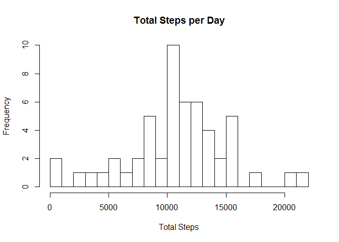
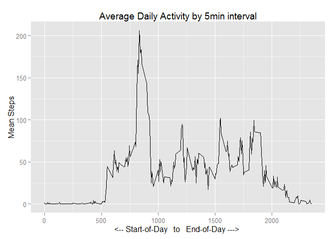
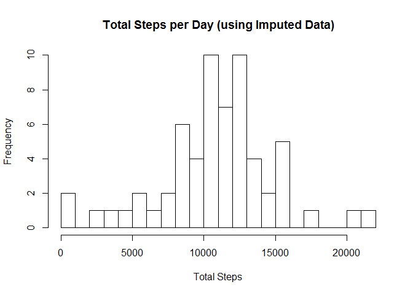
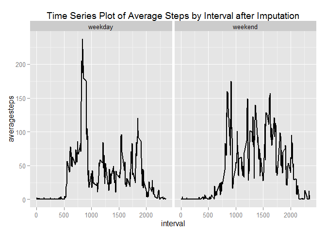

# Reproducible Research: Peer Assessment 1


## Loading and preprocessing the data
   ----------------------------------
   
We'll start by loading the libraries used in this analysis.

#### Libraries....

```r
library("dplyr")
library ("ggplot2")
```

#### Loading Data...  
Note the use of unz to save us a step, and a file. We also chose to use read.csv2 because it's faster.  
The data for this analysis can be obtained here:  
[Activity monitoring data](https://d396qusza40orc.cloudfront.net/repdata%2Fdata%2Factivity.zip)


```r
# load the data
activityData <- read.csv2(unz("activity.zip", "activity.csv"), 
                          sep = ",", 
                          colClasses = c("numeric", "Date", "character"))
```

#### Processing Data....  
We will use dlpyr for all the goodies it allows when shaping data.

```r
# rewrite the dataset as a Table to make it easier to use later
activityData <- tbl_df(activityData)
```

  
## What is mean total number of steps taken per day?
  For this part of the assignment, we will ignore the missing values in the dataset.
  
#### Total steps taken per day.
  We use some dplyr goodness to group and summarise the data into a daily set.
  We the plot the histogram using the hist function.
  

```r
# summarise the total daily steps
dailySteps <- summarise(
                group_by(activityData, date), 
                steps = sum(steps)
              )

# plot the histogram
hist(dailySteps$steps, breaks = 30, main = "Total Steps per Day", xlab ="Total Steps" )
```

 

#### Mean total steps taken per day is: 10,766.19

```r
mean(dailySteps$steps, na.rm = TRUE)
```

```
## [1] 10766.19
```

#### Median total steps taken per day is: 10,765

```r
median(dailySteps$steps, na.rm = TRUE)
```

```
## [1] 10765
```

## What is the average daily activity pattern?
  To compare the average daily activity we will show a time-series plot over the diffirent 5 minute intervals per day.
  When we sourced the data, we specifically kept the interval column as a factor.
  We will numeric verion on the set that we plot in order to sort appropriately.
  We will use dplyr magic to summarise by interval


```r
# summarise the average steps by 5minute interval.
averageStepsByInterval <- summarise(
                            group_by(activityData, interval), 
                            average_steps = mean(steps, na.rm = TRUE)
                          )

# coerce the interval column to a numeric type.
averageStepsByInterval$interval <- as.numeric(averageStepsByInterval$interval)

# plot the daily activity pattern
qplot(averageStepsByInterval$interval, 
    averageStepsByInterval$average_steps,
    geom = "line",
    main = "Average Daily Activity by 5min interval",
    sub = "Average Steps 1-Oct-2012 to 30-Nov-2012",
    xlab = "<-- Start-of-Day   to   End-of-Day ---> ",
    ylab = "Mean Steps")
```

 

#### Which 5 minute interval has the highest average number of steps.  

```r
averageStepsByInterval[which.max(averageStepsByInterval$average_steps), c("interval","average_steps")]
```

```
## Source: local data frame [1 x 2]
## 
##   interval average_steps
##      (dbl)         (dbl)
## 1      835      206.1698
```

Interval 835 has the highest average steps at 206.1698 steps during the 5minutes.


## Imputing missing values
Note that there are a number of days/intervals where there are missing values (coded as NA). The presence of missing days may introduce bias into some calculations or summaries of the data.

#### Calculate the total number of missing values in the dataset.

```r
# Count the rows where steps = NA
sum(is.na(activityData$steps))
```

```
## [1] 2304
```
  
There are 2034 rows where steps = NA.
  
#### Imputation Strategy: Fill in the blanks (complete the dataset by specifying the NA values)

After reviewing the data, I've decided to assign the average value of each DayOfWeek and Interval combination to the missing values. This will be done at the lowest grain and will therefore impact all prior means and medians. We will start by creating a summary by day-of-week and intarval anc calculating the mean of each group. We will then assign those means to the NAs.


```r
# get the average steps by day of week and interval.
averageStepsByWeekdayInterval <- summarise(
                                    group_by(activityData, weekday = weekdays(date),interval), 
                                    weekdayinterval_averagesteps = mean(steps, na.rm = TRUE)
                                  )

# add the new average steps by day-of-week and interval onto the original set and save as new "Complete" set
activityDataComplete <- merge(cbind(activityData,weekday = weekdays(activityData$date)), averageStepsByWeekdayInterval, by = c("weekday","interval"))

# set the steps column = to weekdayinterval_averagesteps where steps=NA
activityDataComplete$steps <- ifelse(is.na(activityDataComplete$steps),activityDataComplete$weekdayinterval_averagesteps, activityDataComplete$steps)
```
  
#### Make a histogram of the total number of steps taken each day
Identical to the first step, we aggregate a set to daily total steps and then plot it.


```r
# summarise the total daily steps
dailyImputedSteps <- summarise(
                group_by(activityDataComplete, date), 
                steps = sum(steps)
              )

# plot the histogram
hist(dailyImputedSteps$steps, breaks = 30, main = "Total Steps per Day (using Imputed Data)", xlab ="Total Steps" )
```

 


#### Mean total steps taken per day is (using Imputed data): 10,821.21

```r
mean(dailyImputedSteps$steps, na.rm = TRUE)
```

```
## [1] 10821.21
```

#### Median total steps taken per day is  (using Imputed data): 11,015

```r
median(dailyImputedSteps$steps, na.rm = TRUE)
```

```
## [1] 11015
```

#### The impact of Imputation
Since I used a fairly granular imputation strategy all means and median are effected.
Compare these last 3 reported results to the first 3.


## Are there differences in activity patterns between weekdays and weekends?

#### Create a new factor to indicate week days and weekend days
This one is simple. Saturdays and Sundays are on the weekend.
We will use mutate from dplyr to add the new factor.


```r
activityDataComplete <- mutate(activityDataComplete,
                               weekend = ifelse(weekday == "Saturday" | weekday == "Sunday", "weekend", "weekday"))
```

#### Make a panel plot containing a time series plot of the 5-minute interval and the average number of steps taken, averaged across all weekday days or weekend days.

We start by summarising the dataset by "weekend" and "interval" aggregating the mean of steps.  
We the need to coerce the interval from character to numberic so that we can plot it on the y axis.
We are plotting using ggplot and will include two facets to show Weekday and WeekEnd side by side.


```r
# summarise the data
weekendintervalSteps <- summarise(
                group_by(activityDataComplete, weekend, interval), 
                averagesteps = mean(steps)
              )

# coerce the interval to numeric.
weekendintervalSteps$interval <- as.numeric(weekendintervalSteps$interval)

# plot the data.
ggplot(weekendintervalSteps,aes(interval,averagesteps)) +
                 ggtitle("Time Series Plot of Average Steps by Interval after Imputation") +
                 facet_grid(. ~ weekend) +
                 geom_line(size = 1)
```

 

There is a clear differince between weekdays and weekends which is not surprising since people tend to be more active on weekends.
